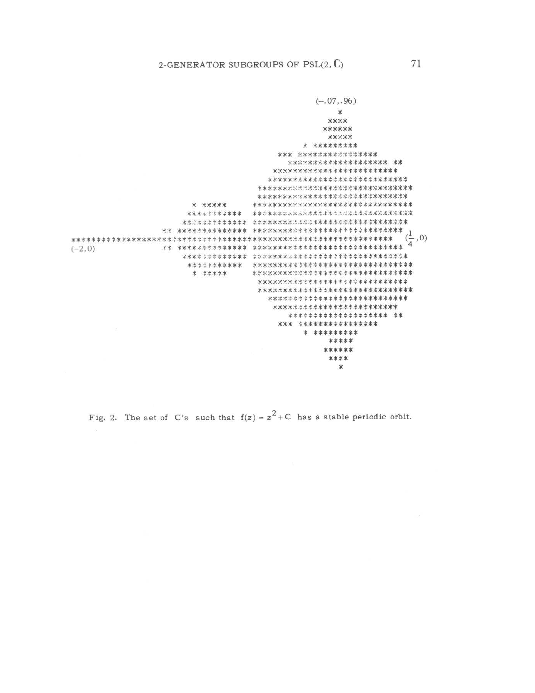
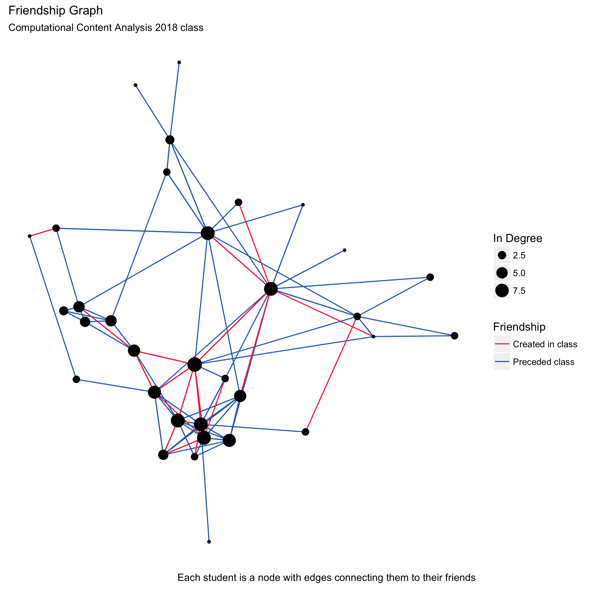

# Part 1

For this critique we will be looking at the visual on page 71 of _The Dynamics of 2-Generator Subgroups of PSL (2, __C__)_ [@brooks1981dynamics], found [here](http://www.math.harvard.edu/archive/118r_spring_05/docs/brooksmatelski.pdf)


## Truthfulness

The visual is trivially truthful, the phenomena that generated it is well known and I have even personally written software to examine the set. This visual when it was created though was the first ever to look at the stable orbits of $f(z) = z^2  + c$ and thus at the time people would have to trust Brooks and Matelski. The one possible truthfulness issue with the visual is that it makes the second smallest circle appear to be an oval. The small circle is in fact perfectly circular and centred around $(-1,0)$ neither of which  is evident from the original figure. This issue though is more of sampling than of truth, the samples were choose without knowing what the shape would be so although a better sampling origin might exist, we only know that post hoc.

## Functional

The visual is very functional. The centring of the real axis is standard in visuals of complex functions and placing the imagery axis slightly to the right of centre leads to a much more visually appealing centring of the figure. Since if was not done the figure would about one third wasted space. That said the indications for each of the axis leave something to be desired as there are only three and one $(-.07,.96)$ is off axis slightly, although this is likely due to their not being a column at exactly $RE(c) = 0$ and thus a limitation of the medium/epoch. The use of purely typewritten components in the visual means every component required thought and effort to create which leads to the minimalism of the (pre) ASCII art drawing, which I belive is much more functional than many of the more complex drawings created recently.

## Beauty

This is a very beautiful figure. This diagram and the improvements after it have inspired huge numbers of other works based almost solely on the esoteric beauty of this class of fractals. The intriguing nature of the set is partiality strong, as I discussed above the visual obscures the circularity of the second mass, but there are an infinite set of other possible variances to examine. The intriguing and deep nature of the set means specialized visualizers exist and are used by the laity simply because of the beauty and intrigue. The set is also intriguing to specialists as the stable orbits exist only where Julia laces (e.g. figure 1 on page 70 of the paper) exist and the unstable obits mark the complementary set of Fatou dusts. The visual thus depicts a mathematically intriguing phenomena and the complexity of the visual makes it all the more interesting. The degradation due to either the scan or age of the source material hampers the beauty slightly as does the slightly slanted real line. Additionally contemporary visuals tend to use colour to indicate near stable obits, leading to a very beautiful effect around the edges. While a second colour might not have been available to the authors, a second (and even third or more) set of characters were adding crosses to mark some of the nearly stable orbits, could make the diagram clearer and more beautiful, although it could also make it unreadable. 

## Insightful

This visual both marks the termination of years of work by Benoit Mandelbrot and many others, and spurs on uncountably more insights in the general population. The complex nature of the set is in many ways best transmitted though a visual. The five pages of archaic complex analysis that proceed it are both curt and indirect in leading to the fundamental insights. That said the fundamental insight into the fractal nature of the set's boundary is not clearly communicated by the diagram, nor the caption, but it is hinted at by the roughness of the edges.

## Enlightening

There are two significant pieces of information in the graphic. First there is the information about the Julia sets, understanding that they are not symmetrical distributed across the reals and in particular that near $(-1,0)$ is rich, is an important point to some people studying complex analysis. The second more generally appealing point is that the a simple formula $f(z) = z^2  + c$ can produce such a complicated shape. If this insight is pursued some of the most beautiful results of complex analysis are quick to emerge, such as much more complete visuals of the Mandelbrot set in the same domain or other more esoteric visuals such as the Buddhabrot [@jovanovic2009new]. These insights also lead to many of the techniques used in contemporary animation for complex scenery and other algorithmically generated objects.


# Part 2

``` {R part_2, eval=FALSE}
library(igraph)
library(ggplot2)
library(purrr)
library(xkcdcolors)

g <- read_graph('friends.graphml', format = "graphml")
g <- igraph::simplify(g, edge.attr.comb = NULL, remove.multiple = FALSE)
g <- delete.vertices(g, degree(g)==0)

l <- layout_nicely(g)
ind <-  degree(g, mode = 'in', normalized = FALSE)

df_nodes <- data.frame(x = l[,1],
                 y = l[,2],
                 in_degree = ind
                 )

df_edges <- data.frame(x1 = unlist(map(as_edgelist(g)[,1], function(x) {l[x,1]})),
                       y1 = unlist(map(as_edgelist(g)[,1], function(x) {l[x,2]})),
                       x2 = unlist(map(as_edgelist(g)[,2], function(x) {l[x,1]})),
                       y2 = unlist(map(as_edgelist(g)[,2], function(x) {l[x,2]})),
                       size_unnormalized = edge_attr(g, 'weight'),
                       Friendship = unlist(map(edge_attr(g, 'new'), 
                                               function(x) {if (x) {"Created in class"}
                                                 else {'Preceded class'}}))
                       )

df_edges['size']  <- df_edges['size_unnormalized'] / sum(df_edges['size_unnormalized'])

df_c<- data.frame(x1 = 2.62, x2 = 3.57, y1 = 21.0, y2 = 15.0)

ggplot(df_nodes, aes(x, y)) +
  geom_segment(data = df_edges,
               aes(x = x1, y = y1, xend = x2, yend = y2, colour = Friendship),
             ) +
  geom_point(aes(size = in_degree)) +
  scale_colour_manual(values = c("Created in class" = name2color("lightish red"), 
                                 "Preceded class" = name2color("medium blue"))) + 
  labs(title = "Friendship Graph", 
       subtitle = "Computational Content Analysis 2018 class", 
       caption = "Each student is a node with edges connecting them to their friends",
       size = 'In Degree') +
  theme(plot.title = element_text(size =12),
        axis.title.x=element_blank(), axis.text.x=element_blank(), axis.ticks.x=element_blank(),
        axis.title.y=element_blank(), axis.text.y=element_blank(), axis.ticks.y=element_blank(),
        panel.background=element_blank())
ggsave("images/friends.png", width = 8, height = 8, dpi = 300)
```

## Graphic




This network was created with a survey conducted by me of James Evans' Computational Content Analysis class. The survey did not ask for friendship directly but instead asked the respondent to for each classmate: ‘In the last 30 days we talked outside of class this many times’. This gives a better measure for friendship than a simple binary choice since people are often bad a remembering and weighing friendship precisely [@marsden2011survey, @marsden1990network, @granovetter1976network]. The students were also asked who they hold in high regard, who they go to for advice and if they became friends during the class. The survey was conducted on the promise of anonymity as such all the students have been identified with numbers. Of the 39 people surveyed 28 responded these are all the students in class during week 7 or week 8 and some of the non-respondents dropped the class or did not participate in voting so the useful response rate if higher than the naive 71% suggested by these numbers. There are also two isolates not included in the visual.

The network can be considered a snapshot of the class. It shows who each person considered to be a friend at that moment in time. One more note, the data collected are all directional, e.g. Alice can remember Bob, but Bob does not remember Alice. This asymmetry is minor and was ignored for this visual as no one disagreed about when they became friends and almost every tie is reciprocated. What is interesting to me about the graph is that there are three clusters. In the upper left, the upper right and the string along the bottom. These three clusters map onto the three groups of students most prominent in the class MAPSS, MACSS and sociology PhDs. This shows that there are strong biases towards in group friendships within the class.

The use of this style of network graph is standard for small networks like this. I could have used a matrix representation, i.e. a heatmap, but those tend to be very ugly and much less initiative to read by the Third Estate. I could also make some kind of plot showing the distribution of friendships across the cohort with a kernel density estimate or scatter plot, but both of those would lose information and liekly be harder to read. The other major representational challenge is in the layout of the nodes. I could have used a simple circular layout, or two separate lines, but instead choose a spring layout. The spring layout treats each edge as a spring, each nodes as positively charged particle and places a gravity well at $(0,0)$ then runs a simple physics simulation. This tends to make anaesthetically pleasing networks with mostly distinguishable nodes and edges. After running a series of these I picked one that was particularly clear and used it.

The choice of layout is a choice of spatial significance, as different algorithms place different weights on proximity. The one I used emphasizes local clustering as well as making intermediate nodes obvious. I also sized the nodes by in degree, thus emphasizing the most popular people, as well as coloured the edges by when the friendship was created. The colouring is intriguing as it shows some temporal effects, most notably that people were making friends outside their original circle. There are no axis displayed on the plot since the layouts are not concerned with scale and networks should not be construed to have one, unless there exists a good reason.

To get the data easily viewed a few transforms were required. First self-loops had to be removed, these provide no useful information and were only included in the original data to make other analysis easier. Additionally the two isolates were removed as they clutter up the diagram since either have to be very far away from each other and the main cluster or risk them being associated with another node. The hardest decision regarding processing was the removal of the labels. Due to the anonymization of the data, each node simply has a number. Including the numbers is tempting and would likely happen if the other graphs were part of the assignment, but it added too much clutter to be worth keeping here.

The main goal of the diagram is to show how there are three somewhat isolated groups in the class, but also note that, even after only eight weeks the clusters are diminishing. To this end a large caption is not required, nor are the axis. I have removed as much from the visual as I can. 

# Bibliography
